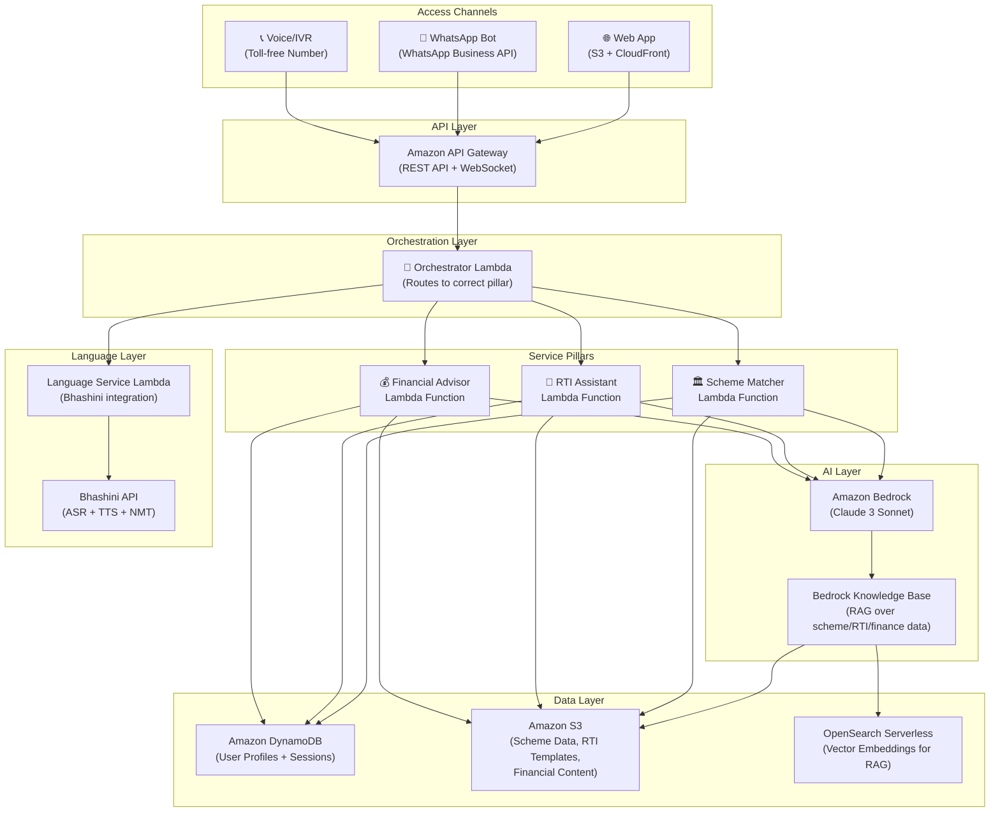
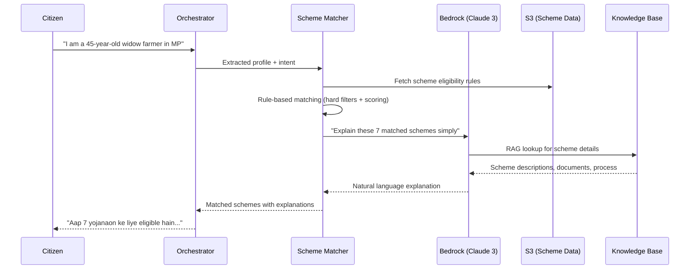
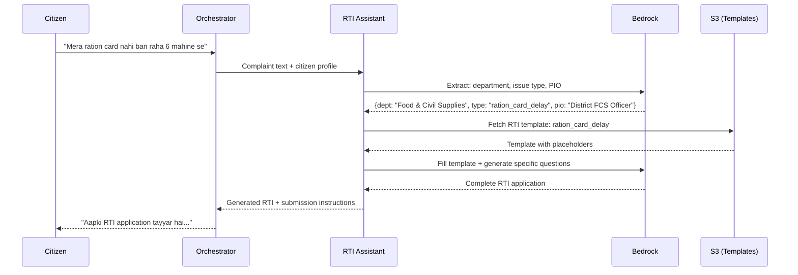

# Design: LokSarthi (लोकसारथी)

## System Architecture

LokSarthi follows a **serverless, event-driven architecture** on AWS, designed for high availability, auto-scaling, and cost efficiency. The system is built around three core service pillars, a shared language processing layer, and a unified conversational AI orchestrator.



---

## Component Design

### 1. API Gateway (Entry Point)

**Service:** Amazon API Gateway (REST + WebSocket)

| Endpoint | Method | Purpose | Lambda Target |
|---|---|---|---|
| `/api/chat` | POST | Text-based conversation | Orchestrator |
| `/api/voice` | POST | Voice input (audio blob) | Language Service → Orchestrator |
| `/api/schemes` | GET | List all available schemes | Scheme Matcher |
| `/api/profile` | GET/PUT | Retrieve/update citizen profile | Orchestrator |
| `/ws/chat` | WebSocket | Real-time streaming conversation | Orchestrator |

**Authentication:** Anonymous access allowed (no login required). Optional phone-number-based session linkage for returning users.

---

### 2. Orchestrator Lambda (Brain)

**Runtime:** Python 3.12 | **Memory:** 512 MB | **Timeout:** 30 seconds

The orchestrator is the central routing engine that:
1. Receives user input (text or transcribed speech)
2. Maintains conversation state via DynamoDB
3. Detects user intent using Bedrock
4. Routes to the correct service pillar
5. Returns response (text + audio via Bhashini TTS)

```python
# Orchestrator - Intent Detection & Routing
PILLAR_ROUTING = {
    "scheme_discovery": "scheme_matcher",
    "scheme_eligibility": "scheme_matcher",
    "rti_filing": "rti_assistant",
    "grievance": "rti_assistant",
    "complaint": "rti_assistant",
    "financial_advice": "financial_advisor",
    "loan_query": "financial_advisor",
    "scam_alert": "financial_advisor"
}

def handle_request(event):
    session = get_or_create_session(event['session_id'])
    user_message = event['message']
    language = event.get('detected_language', 'hi')
    
    # Translate to English for processing (if not English)
    if language != 'en':
        user_message_en = bhashini_translate(user_message, language, 'en')
    
    # Detect intent via Bedrock
    intent = detect_intent(user_message_en, session.conversation_history)
    
    # Route to correct pillar
    pillar = PILLAR_ROUTING.get(intent, "scheme_matcher")
    response_en = invoke_pillar(pillar, user_message_en, session)
    
    # Translate response back to user's language
    response_local = bhashini_translate(response_en, 'en', language)
    
    # Generate speech
    audio_url = bhashini_tts(response_local, language)
    
    return {
        "text": response_local,
        "audio_url": audio_url,
        "language": language,
        "pillar": pillar
    }
```

---

### 3. Scheme Matcher Lambda (Pillar 1)

**Purpose:** Matches citizen profiles against government scheme eligibility rules.

#### Data Flow


#### Eligibility Engine Design

```python
@dataclass
class CitizenProfile:
    age: int
    gender: str                    # male, female, other
    state: str                     # state code
    district: str
    occupation: str                # farmer, labourer, vendor, etc.
    category: str                  # general, sc, st, obc, minority
    annual_income: int
    bpl_status: bool
    disability: bool
    marital_status: str            # married, widowed, single, divorced
    land_ownership: bool
    education_level: str           # none, primary, secondary, graduate
    family_members: int
    pregnant_in_family: bool
    senior_in_family: bool
    children_count: int
    children_in_school: bool

@dataclass
class EligibilityRule:
    age_min: Optional[int]
    age_max: Optional[int]
    gender: Optional[list[str]]
    states: Optional[list[str]]    # None = all states
    occupations: Optional[list[str]]
    categories: Optional[list[str]]
    income_max: Optional[int]
    bpl_required: bool
    disability_required: bool
    marital_status: Optional[list[str]]
    land_required: Optional[bool]

def match_schemes(profile: CitizenProfile, schemes: list) -> list:
    """Rule-based matching with relevance scoring."""
    matches = []
    for scheme in schemes:
        rules = scheme['eligibility']
        
        # Hard filters — must pass ALL
        if not passes_hard_filters(profile, rules):
            continue
        
        # Soft scoring — relevance ranking
        score = compute_relevance_score(profile, scheme)
        matches.append({"scheme": scheme, "score": score})
    
    return sorted(matches, key=lambda m: m['score'], reverse=True)
```

---

### 4. RTI Assistant Lambda (Pillar 2)

**Purpose:** Generates formal RTI applications and routes grievances from plain-language citizen input.

#### RTI Generation Flow


#### RTI Template System

```
Templates stored in S3: s3://loksarthi-data/rti/templates/

├── ration_card_delay.json
├── pension_not_received.json
├── awas_yojana_status.json
├── road_repair_request.json  
├── water_supply_complaint.json
├── electricity_connection.json
├── scholarship_delay.json
├── mgnrega_wage_delay.json
└── ... (50+ templates)

Each template contains:
{
  "template_id": "ration_card_delay",
  "department": "Food & Civil Supplies",
  "default_pio": "District Food & Civil Supplies Officer",
  "fee": "₹10",
  "questions": [
    "When was the application for ration card submitted and what is the application number?",
    "What is the current status of the application and reason for delay?",
    "How many such applications are pending in [district]?"
  ],
  "submission_method": "rtionline.gov.in OR by post to PIO",
  "expected_response": "30 days from receipt"
}
```

---

### 5. Financial Advisor Lambda (Pillar 3)

**Purpose:** Provides financial literacy, detects predatory lending, and guides basic financial processes.

#### Core Functions

```python
class FinancialAdvisor:
    
    def explain_loan(self, principal, rate, tenure_months):
        """Explain a loan in simple terms with exact rupee amounts."""
        emi = self.calculate_emi(principal, rate, tenure_months)
        total_payment = emi * tenure_months
        total_interest = total_payment - principal
        
        return {
            "monthly_emi": emi,
            "total_payment": total_payment,
            "total_interest": total_interest,
            "explanation": f"Agar aap ₹{principal:,} ka loan lete hain, "
                          f"to har mahine ₹{emi:,.0f} dena hoga. "
                          f"Kul milakar ₹{total_payment:,.0f} wapas karna hoga. "
                          f"Matlab ₹{total_interest:,.0f} sirf byaaj mein jayega."
        }
    
    def detect_predatory(self, annual_rate):
        """Flag predatory interest rates."""
        if annual_rate > 36:
            return "⚠️ KHATRE KA LOAN: Yeh rate bahut zyada hai. " \
                   "Sarkar ki yojana se sasta loan mil sakta hai."
        return None
    
    def detect_scam(self, description):
        """Match against known scam patterns."""
        scam_patterns = [
            {"pattern": "OTP share", "alert": "OTP KABHI KISIKO MAT DEIN"},
            {"pattern": "advance fee", "alert": "Loan ke liye pehle paisa mangna FRAUD hai"},
            {"pattern": "lottery win", "alert": "Yeh FRAUD hai. Aapne koi lottery nahi jeeti"},
        ]
        # Bedrock-powered pattern matching for nuanced detection
        return check_against_patterns(description, scam_patterns)
```

---

### 6. Language Service Lambda (Bhashini Integration)

**Purpose:** Handles all multilingual processing — ASR, TTS, and Translation.

#### Bhashini API Integration

```python
BHASHINI_CONFIG = {
    "user_id": "<from_bhashini_portal>",
    "ulca_api_key": "<from_bhashini_portal>",
    "inference_api_key": "<from_bhashini_portal>",
    "pipeline_url": "https://meity-auth.ulcacontrib.org/ulca/apis/v0/model/getModelsPipeline"
}

SUPPORTED_LANGUAGES = {
    "hi": "Hindi",     "ta": "Tamil",      "te": "Telugu",
    "bn": "Bengali",   "mr": "Marathi",    "gu": "Gujarati",
    "kn": "Kannada",   "ml": "Malayalam",   "or": "Odia",
    "pa": "Punjabi",   "as": "Assamese",   "ur": "Urdu"
}

class BhashiniService:
    
    def speech_to_text(self, audio_bytes, source_lang=None):
        """Convert speech to text. Auto-detects language if not specified."""
        # Step 1: Get ASR model for language
        pipeline = self.get_pipeline("asr", source_lang or "hi")
        # Step 2: Send audio for transcription
        result = self.call_inference(pipeline, audio_bytes)
        return {
            "text": result["output"]["source"],
            "language": result.get("detected_language", source_lang)
        }
    
    def text_to_speech(self, text, language):
        """Convert text to speech in target language."""
        pipeline = self.get_pipeline("tts", language)
        result = self.call_inference(pipeline, text)
        return result["audio_base64"]
    
    def translate(self, text, source_lang, target_lang):
        """Translate between Indian languages."""
        pipeline = self.get_pipeline("nmt", source_lang, target_lang)
        result = self.call_inference(pipeline, text)
        return result["output"]["target"]
```

---

## Data Model

### DynamoDB Tables

#### Table: `loksarthi-users`
| Attribute | Type | Description |
|---|---|---|
| `user_id` (PK) | String | UUID or phone number hash |
| `profile` | Map | CitizenProfile object |
| `language_preference` | String | ISO 639-1 code |
| `created_at` | Number | Epoch timestamp |
| `updated_at` | Number | Epoch timestamp |
| `ttl` | Number | Auto-expiry (1 year) |

#### Table: `loksarthi-sessions`
| Attribute | Type | Description |
|---|---|---|
| `session_id` (PK) | String | UUID |
| `user_id` (GSI) | String | Links to user |
| `conversation_history` | List | [{role, message, timestamp}] |
| `current_pillar` | String | scheme/rti/financial |
| `profile_snapshot` | Map | Profile at time of session |
| `matched_schemes` | List | Results from scheme matching |
| `created_at` | Number | Epoch timestamp |
| `ttl` | Number | Auto-expiry (30 days) |

#### Table: `loksarthi-schemes`
| Attribute | Type | Description |
|---|---|---|
| `scheme_id` (PK) | String | Unique scheme identifier |
| `name` | String | Scheme name (English) |
| `name_local` | Map | {lang_code: localized_name} |
| `ministry` | String | Governing ministry |
| `benefit_type` | String | cash/kind/service/insurance |
| `benefit_amount` | String | Human-readable benefit description |
| `eligibility` | Map | EligibilityRule object |
| `documents_required` | List | Required documents |
| `how_to_apply` | String | Application instructions |
| `apply_url` | String | Online application URL |
| `state` | String | "all" or specific state code |
| `tags` | List | Searchable tags |

---

## S3 Bucket Structure

```
s3://loksarthi-data/
├── schemes/
│   ├── central_schemes.json          # 100 curated central schemes
│   └── state_schemes/
│       ├── madhya_pradesh.json
│       ├── uttar_pradesh.json
│       ├── rajasthan.json
│       ├── tamil_nadu.json
│       └── ...
├── rti/
│   ├── templates/                     # 50+ RTI templates
│   │   ├── ration_card_delay.json
│   │   ├── pension_not_received.json
│   │   └── ...
│   ├── pio_directory.json            # PIO contact database
│   └── rti_act_reference.json        # RTI Act sections
├── financial/
│   ├── scam_patterns.json            # Known fraud patterns
│   ├── govt_loan_schemes.json        # Mudra, SVANidhi, KCC, etc.
│   └── gst_guide.json               # GST basics
└── knowledge_base/                    # Preprocessed for Bedrock KB
    ├── schemes_kb.txt                 # Chunked scheme descriptions
    ├── rti_kb.txt                     # RTI process knowledge
    └── financial_kb.txt               # Financial literacy content
```

---

## Frontend Design

### Web Interface Architecture

**Hosting:** S3 + CloudFront (static site)
**Framework:** Vanilla HTML/CSS/JS (minimal bundle, fast load on 2G/3G)

#### Design Principles
- **Primary action:** Large microphone button (64px, high-contrast, pulsing animation)
- **Color scheme:** Saffron (#FF9933) + White + Green (#138808) — India tricolor palette
- **Typography:** Google Fonts `Noto Sans` (supports all Indian scripts)
- **Accessibility:** Minimum 18px body text, 48px touch targets, WCAG 2.1 AA compliant
- **Responsive:** Works on screens as small as 320px (basic Android phones)

---

## AWS Infrastructure (SAM Template)

```yaml
# template.yaml (AWS SAM)
AWSTemplateFormatVersion: '2010-09-09'
Transform: AWS::Serverless-2016-10-31
Description: LokSarthi - AI-powered citizen services platform

Globals:
  Function:
    Runtime: python3.12
    Timeout: 30
    MemorySize: 512
    Environment:
      Variables:
        SCHEMES_BUCKET: !Ref DataBucket
        USER_TABLE: !Ref UsersTable
        SESSION_TABLE: !Ref SessionsTable
        BEDROCK_MODEL_ID: anthropic.claude-3-sonnet-20240229-v1:0
        BHASHINI_USER_ID: !Ref BhashiniUserId
        BHASHINI_API_KEY: !Ref BhashiniApiKey

Resources:
  # API Gateway
  LokSarthiApi:
    Type: AWS::Serverless::Api
    Properties:
      StageName: prod
      Cors:
        AllowOrigin: "'*'"
        AllowMethods: "'GET,POST,OPTIONS'"

  # Lambda Functions
  OrchestratorFunction:
    Type: AWS::Serverless::Function
    Properties:
      Handler: orchestrator.handler.lambda_handler
      CodeUri: lambda_functions/orchestrator/
      Events:
        Chat:
          Type: Api
          Properties:
            Path: /api/chat
            Method: post
            RestApiId: !Ref LokSarthiApi

  SchemeMatcherFunction:
    Type: AWS::Serverless::Function
    Properties:
      Handler: scheme_matcher.handler.lambda_handler
      CodeUri: lambda_functions/scheme_matcher/

  RTIAssistantFunction:
    Type: AWS::Serverless::Function
    Properties:
      Handler: rti_assistant.handler.lambda_handler
      CodeUri: lambda_functions/rti_assistant/

  FinancialAdvisorFunction:
    Type: AWS::Serverless::Function
    Properties:
      Handler: financial_advisor.handler.lambda_handler
      CodeUri: lambda_functions/financial_advisor/

  # DynamoDB Tables
  UsersTable:
    Type: AWS::DynamoDB::Table
    Properties:
      TableName: loksarthi-users
      BillingMode: PAY_PER_REQUEST
      AttributeDefinitions:
        - AttributeName: user_id
          AttributeType: S
      KeySchema:
        - AttributeName: user_id
          KeyType: HASH
      TimeToLiveSpecification:
        AttributeName: ttl
        Enabled: true

  SessionsTable:
    Type: AWS::DynamoDB::Table
    Properties:
      TableName: loksarthi-sessions
      BillingMode: PAY_PER_REQUEST
      AttributeDefinitions:
        - AttributeName: session_id
          AttributeType: S
      KeySchema:
        - AttributeName: session_id
          KeyType: HASH
      TimeToLiveSpecification:
        AttributeName: ttl
        Enabled: true

  # S3 Bucket for Data
  DataBucket:
    Type: AWS::S3::Bucket
    Properties:
      BucketName: loksarthi-data

  # Frontend Hosting
  FrontendBucket:
    Type: AWS::S3::Bucket
    Properties:
      BucketName: loksarthi-frontend
      WebsiteConfiguration:
        IndexDocument: index.html
```

---

## Security Design

| Concern | Mitigation |
|---|---|
| **Data at rest** | AES-256 encryption on DynamoDB + S3 (AWS-managed keys) |
| **Data in transit** | TLS 1.3 enforced on API Gateway |
| **No PII collection** | No Aadhaar, bank details, or biometrics stored |
| **Session isolation** | Each session gets a unique UUID; no cross-session data leakage |
| **Auto-cleanup** | DynamoDB TTL auto-deletes sessions (30 days) and unused profiles (1 year) |
| **API rate limiting** | API Gateway throttling: 100 requests/second per IP |
| **DPDP Act compliance** | Right to erasure: citizen can request "delete my data" |

---

## Deployment Strategy

| Phase | Scope | Timeline |
|---|---|---|
| **Hackathon MVP** | Web app + Scheme Discovery (50 schemes) + basic RTI templates + loan calculator | 1 week |
| **Pilot** | Add 10 regional languages, expand to 200 schemes, WhatsApp integration | 1 month |
| **Scale** | Full 750+ schemes via MyScheme API, state-level RTI, IVR dial-in | 3 months |
| **Production** | CSC integration, offline mode, real-time scheme updates | 6 months |

---

## Testing Strategy

| Test Type | Scope | Tool |
|---|---|---|
| **Unit Tests** | Eligibility matching logic, loan calculator, scam detection | pytest |
| **Integration Tests** | Lambda → Bedrock → S3 flow, Bhashini API connectivity | pytest + moto (AWS mocking) |
| **E2E Tests** | Full conversation flow: voice input → scheme output | Browser testing via Selenium |
| **Accuracy Tests** | Scheme matching against 20 known citizen profiles with expected results | Custom test harness |
| **Language Tests** | Bhashini ASR/TTS quality across 10 languages | Manual + automated BLEU scores |
